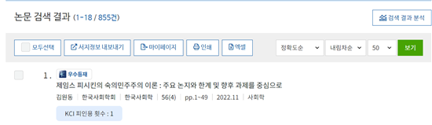
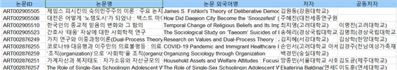
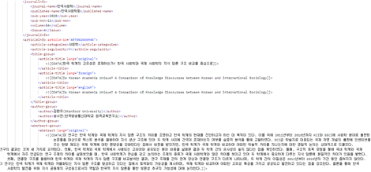
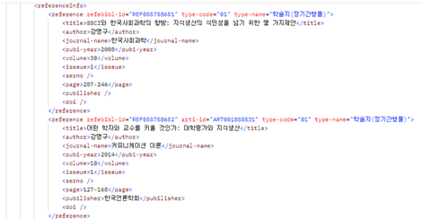
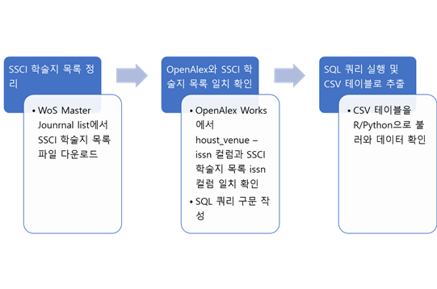

# 전산사회과학 연구과정의 블랙박스 열기 Appendix
이 Github 페이지는 "(연구노트) 전산사회과학 연구과정의 블랙박스 열기"에서 제시된 학술 데이터베이스 수집방법을 알려주는 메뉴얼이자 부록이다. 데이터 분석 과정에 활용한 코드는 code 폴더를 참고 할 것.

 ### 1. KCI 논문 데이터 내보내기
 KCI 논문 서지데이터를 수집하는 가장 쉬운 방법은 KCI 홈페이지에 내장된 ‘내보내기’ 기능을 활용하는 것이다. 검색어나 학문 분류 등을 통해 연구자가 원하는 조건의 논문을 검색한 후 ‘서지정보 내보내기’ 기능을 통해 txt, RefWorks, Endnote, XML 등의 형태로 서지사항을 내보낼 수 있다 (<Figure 1> 참조). 다만 KCI 논문검색이 한 페이지당 최대로 선택할 수 있는 논문 수는 300건으로 한계가 있다. 이때는 엑셀로 내보내기 기능을 이용하길 추천한다. ‘엑셀’이라고 적힌 버튼을 누르면 최대 2000건까지 한꺼번에 서지 정보를 다운 받을 수 있다. 기존 문헌정보학 연구에서는 위의 서지 정보 내보내기를 통해 데이터를 수집해 분석하였고, 수집과정에 반복 작업이 필요했다 (이재윤, 2021; 정유경, 2020; Kim, 2022). 이 당시에는 후술할 API가 제대로 구축되어 있지 않았고, 데이터 요청 과정도 구조화되어 공지되지 않았기 때문이다.

\<Figure 1\> Example of search results in KCI webpage  

아래 그림(<Figure 2>)은 ‘서지정보 내보내기’ 기능을 사용하였을 때의 결과를 보여준다. 이 엑셀 파일에는 논문 고유ID를 비롯한 제목, 저자, 주제어 등의 주요 서지정보가 포함되어 있다. 다만 자연어처리/텍스트마이닝의 주요 대상이 될 국영문 초록 정보와 계량서지학/네트워크 분석에 필요한 참고문헌 목록과 KCI 인용 논문 정보가 없는 것이 단점이다. 이때는 KCI OPEN API를 활용해야한다.

\<Figure 2\> Example of an excel file including exported KCI bibliographic data  

 KCI가 제공하는 API는 총 다섯 가지이다. 인용지수 관련 두 가지와 논문 관련 세 가지가 있는데 논문 API에는 1) 논문 기본 정보, 2) 논문 상세 정보, 3) 참고문헌 정보가 있다. 여기서는 논문 API를 중심으로 다룬다. 우선 API를 활용하려면 [API 페이지](https://www.kci.go.kr/kciportal/po/openapi/openApiList.kci)에서 <OPEN API 키신청>을 통해 API 키를 발급받아야 한다. API 이용 신청서 작성을 통해 1주일 이내 승인이 이뤄진다. 발급받은 API 키 번호를 활용해 특정 논문의 기본 정보를 가져오는 URL 예시는 다음과 같다.[1](#f1)

http://open.kci.go.kr/po/openapi/openApiSearch.kci?apiCode=articleSearch&key=12345678&displayCount=100&  

\<Table 1\> The summary of values included in API request URL
|Parameter|Value|Description|
|:----|:----|:----|
|apiCode|articleSearch|The name of API that requests basic information of articles|
|key|12345678(example)|API Key|
|displayCount|100|The number of requested papers per trial|
|id|ART002656945|Article ID|

위 예시 URL은 <Table 1>과 같이 정리할 수 있다. apiCode 파라미터는 연구자가 요청할 API의 종류를 뜻하는데 논문 기본정보의 값은 articleSearch이다. key 파라미터에는 자신의 API 키를 넣어야 한다. displayCount는 한 번에 요청할 수 있는 논문 수이며, 예를 들어 100이라고 기입하면 최대 100건의 논문이 검색된다. 위 예시에서는 id 파라미터에 특정 논문의 id를 추가했기 때문에 논문 한 건의 정보만 나온다. 위 파라미터 외에도 제목, 저자명, 저널명 등의 다양한 파라미터를 활용해 여러 건의 논문 정보를 요청할 수 있다. API 요청 결과는 XML(Extensible Markup Language) 형태로 받아볼 수 있다. XML은 웹상에서 데이터를 쉽게 주고받을 수 있게 만든 마크업 언어이다. 태그(tag)와 요소(element)로 정보를 표현하며 파싱(parsing) 과정을 통해 연구자가 원하는 데이터를 추출 및 변형할 수 있다.[2](#f1). 아래 예시(<Figure 3>)처럼 서지 내보내기에는 없었던 초록이나 참고문헌 정보를 API에서는 확인할 수 있다.

\<Figure 3\> Example of an API view page with an article’s abstract text    

\<Figure 4\> Example of an API view page with an article’s reference list    

만약 서지정보 내보내기로는 감당하기 어려운 분량의 데이터를 수집해야하거나, API를 다루기 어려울 때는 KCI에 직접 데이터를 요청할 수 있다. [데이터 신청 페이지](https://www.kci.go.kr/kciportal/po/openapi/openReqDataList.kci)에서 신청 양식에 자신이 원하는 데이터 조건(연도, 학술지, 학문 분류 등)을 상세히 적으면 네 가지 형태(논문 기본/상세/피인용/인용)의 엑셀파일(xls)을 받을 수 있다. 실제로 우리는 API 수집의 한계(일일 요청량 제한)로 한국연구재단에 데이터 제공을 여러 번 문의했으며, 그 결과 2022년 7월부터 데이터 직접 요청 서비스가 시작되었다.

### 2. KRI 연구자 정보 크롤링 과정
[KRI(한국연구자정보)](https://www.kri.go.kr/kri2) 웹크롤링 과정은 다음과 같다. 1) KCI 논문 상세페이지나 API 등을 활용해 논문 저자의 고유 id(예:CRT001954065) 확인, 2) 해당 저자 id를 바탕으로 KCI의 개인 연구자 정보 페이지로 이동 후, 국가연구자 번호 확인, 3) 해당 국가 연구자번호를 KRI 사이트에서 검색해서 인구사회학정보 수집. 예를 들어 김병준, 천정환의 [논문 페이지](https://www.kci.go.kr/kciportal/ci/sereArticleSearch/ciSereArtiView.kci?sereArticleSearchBean.artiId=ART002647202)에서 ‘김병준’을 클릭하면 해당 저자의 [연구자 정보 페이지](https://www.kci.go.kr/kciportal/po/citationindex/poCretDetail.kci?citationBean.cretId=CRT001954065)를 알 수 있다. 해당 페이지에서 ‘관심등록’ 버튼에 숨겨진 국가연구자 번호(1150****)를 확인할 수 있다. 해당 번호로 KRI 검색창에 성명과 국가연구자번호로 검색하면 성별, 생년, 최종학위 학교 등의 정보를 확인할 수 있다. 이 과정은 다양한 웹크롤링 패키지(Beautifulsoup4, Selenium 등)을 동원해야 하는 작업이라 앞선 과정들보다 복잡한 코드를 요한다.

### 3. OpenAlex 관련 구체적인 내용
 OpenAlex는 하나의 데이터베이스 테이블이 아니라 여러 정보집단(Entity)이 유기적으로 연결되어 분리, 저장돼 있다.[3](#f1) 2023년 3월 기준으로 총 7개의 정보집단이 있으며 이는 <Table 2>와 같다. 가장 중요한 데이터베이스는 학술 결과물 정보가 실린 ‘Works’이다. 이를테면 SSCI 학술지에 실린 모든 논문의 서지정보를 찾으려면 ‘Sources’에서 SSCI의 모든 학술지 목록을 검색 조건으로 하고, 해당 학술지의 고유 id를 추출한 후 이를 ‘Works’에서 검색해야 한다.

\<Table 2\> The structure of OpenAlex database
|Entity|설명|Entity|설명|
|:----|:----|:----|:----|
|Works|학술 결과물(논문, 단행본 등) 데이터베이스|Concepts|Works에 할당된 개념 데이터베이스|
|Authors|Works의 저자 데이터베이스|Publishers|Works를 배포하는 단체(출판사, 회사 등)|
|Sources|Works의 발간처(학술지, 컨퍼런스 등) 데이터베이스|Geo|대륙이나 지역 관련 데이터베이스|
|Institutions|Authors의 소속 조직(대학, 연구기관 등) 데이터베이스| | |

 OpenAlex 에서도 KCI와 동일하게 [API](https://docs.openalex.org/how-to-use-the-api/api-overview)를 제공한다. 하지만 API 접근으로는 수백만건 이상의 대량 데이터를 한꺼번에 가져오는데 시간이 오래 걸리기 때문에 소규모의 데이터 샘플을 확인하거나 OpenAlex를 활용한 코딩 교육에 활용하는 것을 추천한다. R이나 Python 기반의 API 활용 패키지(openalexR, PyAlex 등)가 이미 있으므로 해당 언어 사용자라면 편리하게 API 활용이 가능하다. OpenAlex는 기본적으로 JSON(JavaScript Object Notation) 포맷으로 구축돼 있으며 [예시 API URL](https://api.openalex.org/works/W2741809807)로 접속해보면 이를 확인할 수 있다. JSON은 앞서 설명한 XML과 유사한 웹 데이터 포맷으로 키-값 쌍으로 이뤄져있다. 예를 들어, ‘works/‘W2741809807’은 works-entity 아래 서지 고유 id로 JSON 파일을 요청한 API 주소이다. 
 하지만 API는 OpenAlex 전수 데이터를 한 번에 처리할 수 없기 때문에, OpenAlex에서는 모든 Entity를 매월 JSON 형태로 데이터를 업로드해준다. 이를 스냅샷(Snapshot)이라고 부르며 아마존 웹서비스(Amazon Web Service) 명령어를 통해 다운로드 받을 수 있다([관련 페이지](https://docs.openalex.org/download-all-data/download-to-your-machine)). OpenAlex에서는 다운로드 받은 JSON 파일로 자신만의 데이터베이스를 구축하는 두 가지 방법을 추천한다. [첫 번째](https://docs.openalex.org/download-all-data/upload-to-your-database/load-to-a-data-warehouse)는 구글에서 제공하는 클라우드 데이터 웨어하우스인 BigQuery에 JSON 파일을 올려서 테이블을 구축하는 방법이다. 이 방법은 연구자가 따로 서버 컴퓨터를 보유하지 않았다면 추천하는 방법으로 BigQuery 사용량만큼 결제를 해야 한다. [두번째 방법](https://docs.openalex.org/download-all-data/upload-to-your-database/load-to-a-relational-database)은 고성능 서버 컴퓨터(리눅스)를 보유했다면 쓸 수 있는 방법으로 PostgreSQL로 데이터베이스를 구축하는 것이다. PostgreSQL은 오픈소스 관계형 데이터베이스로 쿼리(query) 구문을 활용해 원하는 데이터를 추출하거나 조인(join)할 수 있다. 우리는 이 방법을 활용해 OpenAlex 데이터베이스 서버를 구축하였다.
 우리에게는 SSCI 학술지에 실린 각 학문분야별 논문 서지데이터를 확보하는 것이 1차 목표였다. 이를 위해 우리는 우선 [Web of Science Master Journal list](https://mjl.clarivate.com/collection-list-downloads)에서 2022년 기준 SSCI 학술지 목록을 다운받아 해당 목록에서 학술지 제목, 학문분류(Categories), 언어, (e)ISSN 컬럼을 확인하였다. SSCI 목록의 ISSN과 OpenAlex ‘Works’에 있는 ‘host_venue’[4](#f1)의 ‘issn’ 컬럼이 일치하는지 쿼리 조건문을 작성하였다. 쿼리를 통해 OpenAlex에 있는 SSCI 학술지의 id를 확보했고, 해당 id와 일치하는 모든 학술지 논문의 서지정보를 추출할 수 있었다. 이 과정에서 SSCI 학술지 목록에는 있지만 OpenAlex 목록에는 존재하지 않는 학술지를 발견하였는데, 이들은 ISSN 번호가 변경된 학술지였다. 전 추출 과정을 도표로 정리하면 <Figure 5>와 같다. 

\<Figure 5\> The process of extracting SSCI indexed journals and articles from OpenAlex database    

### 각주
<b id="f1">1</b> API 요청 파라미터에 대한 자세한 설명은 각 API 페이지를 참고할 것. [↩](#a1)  
<b id="f2">2</b> XML에 관련한 내용은 [다음 글](https://www.webzineriks.or.kr/post/디지털-인문학-연구를-위한-공공데이터-활용-2-김병준)을 참고할 것.[↩](#a2)  
<b id="f2">3</b> 자세한 데이터베이스 설명은 다음 [링크](https://docs.openalex.org/api-entities/entities-overview)를 참고할 것.[↩](#a3)  
<b id="f4">4</b> 2023년 3월 기준으로 host_venue 대신 [primanry_location](https://docs.openalex.org/api-entities/works/work-object#primary_location) 컬럼 사용 추천. [↩](#a4)

### 참고문헌
이재윤. 2021. “KCI 인문학과 사회과학 학술지의 다학문성과 학제성 분석: 일반 및 기타 분야를 중심으로” 『정보관리학회지』 38(2):227-250.  
정유경. 2020. “국내 문헌정보학 분야 학술지의 인용 네트워크분석” 『한국문헌정보학회지』 54(4):221-238.  
Kim, Byungjun. 2022. “Mapping the knowledge structure of Korean humanities : Bibliographic data analysis of humanities journal articles in the Korea citation index, 2004~2019.” 박사학위논문, 성균관대학교, 서울  